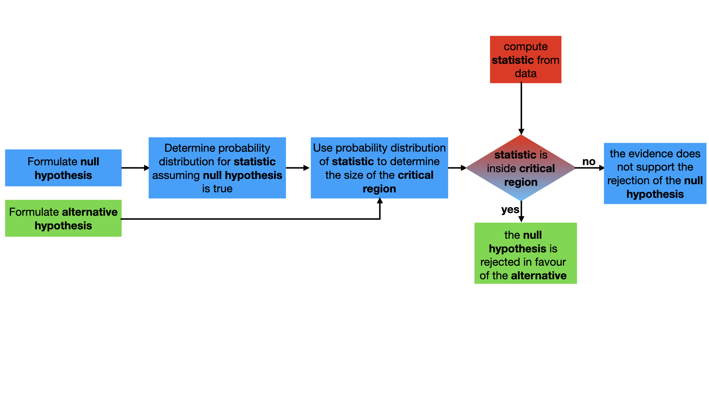

# One tail tests

As discussed in the previous task and as shown in the flowchart below both the null and alternative hypothesis are used when we determine the critical region for a hypothesis test:

The last task showed that both these hypotheses are required because there is an infinite number of ways to set up a 95% __confidence limit__ on a statistical distribution.  For hypothesis tests on single variables, however, there are really only three ways of setting up the __confidence limit__ and __critical region__ that matter as the only null () and alternative hypotheses () we ever use are: 

We have seen how to set up the __critical region__ if the alternative hypothesis is that the parameter is not equal to the value given in the statement of the problem in the previous tasks.  If the __alternative hypothesis__ is that the parameter is less than the value given in the statement of the problem setting up the arguably even easier.  In this case, the __statistic__ is within the critical region for a 5% __significance level__ if it is less than the 5th percentile of the distribution.  Similarly, if we are testing whether the parameter is greater than the value in the statement of the question the statistic is within the __critical region__ for a 5% __significance level__ if it is greater than the 95th percentile of the distribution.

With all that you have learned in mind, I want you to answer the following question.

_A farmer is concerned that a disease has spread amongst the trees in his orchard as the fruits seem lighter than in previous years.  The average weight of his apples last year was 97g and the standard deviation was 4g.  This year the 100 apples he has harvested from his smallest orchard have an average weight of 85g.  Perform a statistical test at a 90% confidence limit to determine if the farmer is right to be concerned?  You may assume that the standard deviation for the apples in this year's harvest is the same as it was last year._ 

__Your task in this exercise is to write code to answer this question.__  As always you need to follow the procedure outlined in the flow chart above.  I have written some functions to perform the tests for you to use to solve the problem.  Notice, furthermore, that, at variance with the previous tasks, the `criticalRange` __function should return one number only and not two__.  In addition to completing the two functions, you need to also set some variables:

1. `mu0` - should be set equal to the expectation of the distribution of apple weights that is assumed under the null hypothesis.
2. `sigma` - should be set equal to the standard deviation of the distribution of apple weights that is assumed under the null hypothesis.
3. `observation` - should be set equal to the statistic the farmer has measured
4. `nmeasurements` - should be set equal to the number of measurements the farmer has used when calculating the statistic

